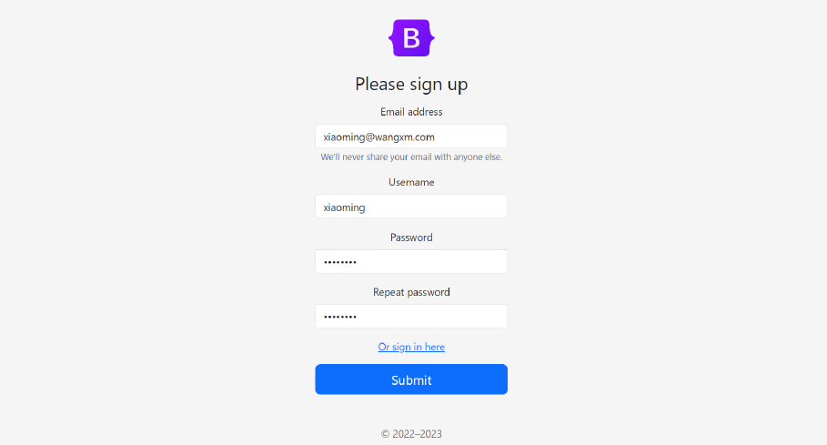
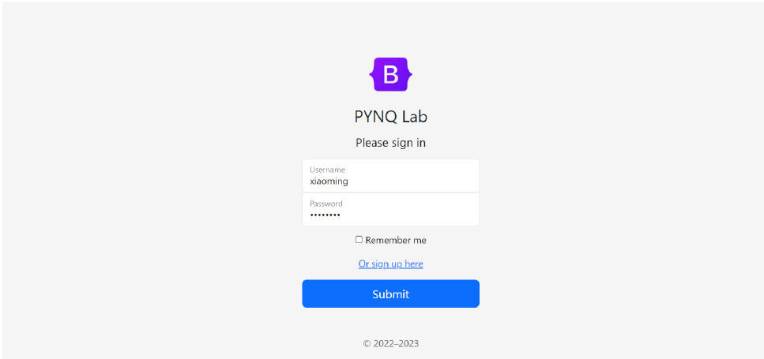
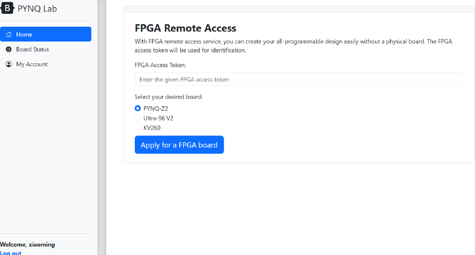
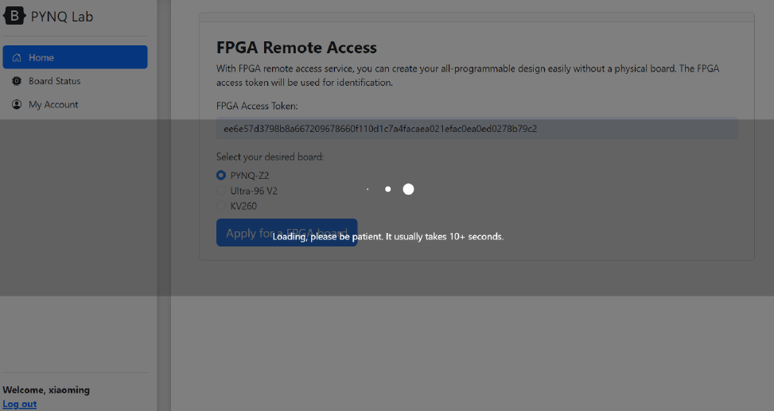
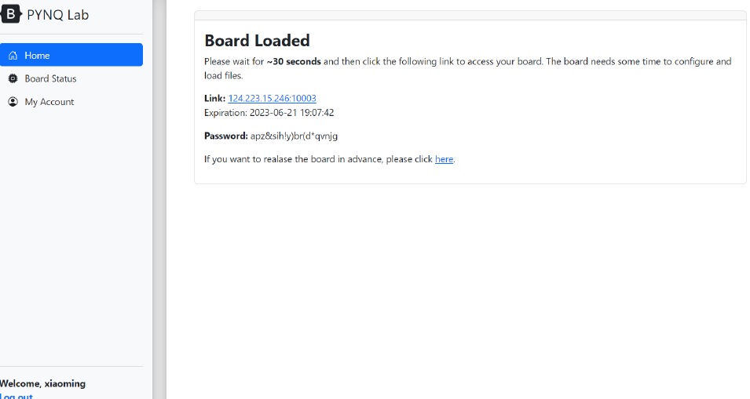
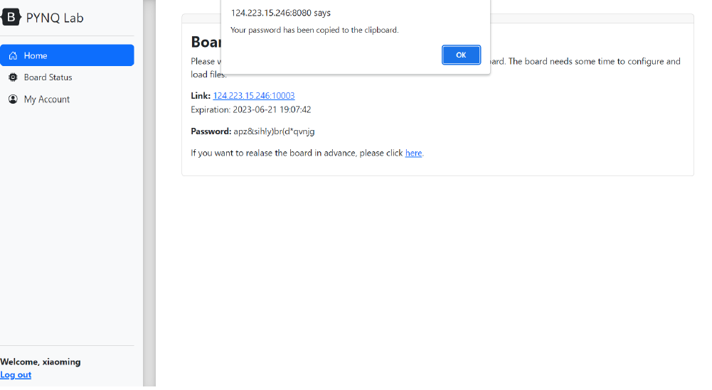
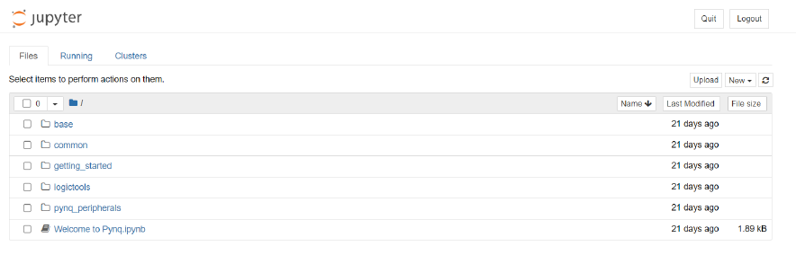
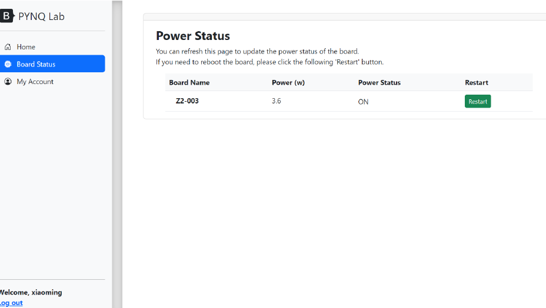

# AEEE  Summer School PYNQ Lab 使用说明

## 注册与登录

1. 访问[http://212.129.248.110:8996/](http://212.129.248.110:8996/ "http://212.129.248.110:8996/")signup/，填写注册信息，此处的Username项需要
   填写英文字符。填写完成后，点击Submit按钮进行提交。

   
2. 提交后，如果成功将显示如下界面，点击here返回到登录⻚面；如果失败，请根
   据提示内容修改注册信息。

   
3. 自动跳转到登录界面/signin/后 ，我们依次输入账号密码，并点击Submit提交。

   

# 申请板卡

1. 登录成功后，将来到如下板卡申请界面。选中第一个Home⻚面，在FPGA Access
   Token处填入所给的Token值，并勾选希望使用的板卡。


   
2. 点击Apply for a FPGA board按钮，即可申请一张FPGA板卡。此时窗口显示
   加载状态， **请不要刷新⻚面或重复Apply** ，此时系统已在后台分配板卡资源中。如
   果板卡都在使用，会提示无法申请，请之后再试。

   
3. 等待约 10 秒钟，系统将自动跳转到如下界面。点击下方Link字样后的 **蓝色链接** 可
   以跳转到一个新网⻚，该网⻚将映射后台系统中某张FPGA上的Jupyter服务，通
   常这一Jupyter Server需要10-20秒钟才能启动完毕，用戶可以稍等20-30秒钟
   后再刷新这一网址尝试。

   
4. 接着，我们可以点击该⻚面中的Password字段，Jupyter Notebook的密码将
   自动复制到用戶的剪切板，浏览器也会给出对应提示。

   
5. 之后，我们仍然访问Link字样后的 **蓝色链接** ， 如果板卡Jupyter服务已经启动完
   毕，我们将看到如下Jupyter登录界面。我们将刚复制的密码粘贴到输入框中，并
   点击Log in.

   
6. ⻚面将跳转到Jupyter Notebook的tree⻚面下，我们可以像本地使用PYNQ一
   样运行notebook了。此外，该目录下的文件修改都将被后台系统保存下来，并在用
   戶下一次使用该类型板卡时自动加载，该目录外的修改将不被保留。

   

# 释放板卡

1. 每张板卡都有单次使用时⻓的限制，目前设置为 90 分钟，过期自动释放。例如某同学在下午3:00申请了一张板卡开始开发，那么该板卡将在当天下午4:30由系统自动释放。
2. 用戶也可以手动提前释放板卡，只需要单击下方的here字样。
3. 释放板卡同样会显示一个加载界面， 请耐心等待数秒、不要刷新界面 。
4. 成功后将显示如下字样，点击here返回主⻚。

# 其他功能

## 板卡重启

1. 为了处理可能的FPGA板卡系统崩溃问题，我们提供了板卡重启功能，这一功能将控制FPGA电源 重新上下电 来强制重启Linux。
2. 为了使用这一功能，可以点击左侧tab切换到Board Status界面。如果用戶有正在使用的板卡，右侧将显示目前分配的FPGA板卡编号当前功耗与上电状态。单击最右侧的Restart按钮即可重启板卡。



3. 成功后，将显示对应提示信息，此时板卡已经在后台进行重启中，我们可以点击

```
here返回主⻚。由于是板卡整体重新上电，需要重新启动板卡Linux和Jupyter
服务，因此将需要约 1 分钟 的时间才能继续正常使用，请耐心等待。
```

## 密码修改

```
用戶可以更新密码。只需要切换到左侧 My Account 账戶，按表单要求输入旧密码
与新密码，再点击Submit提交即可，成功后同样会显示对应提示信息。
```
